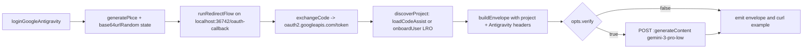

# Add `google-antigravity` provider + cheapest-verify-model audit

## What Antigravity is

Antigravity is Google's AI IDE. It uses **standard Google OAuth 2.0 with PKCE**, but with a different client_id/secret than the `gemini` CLI, extra scopes (`cclog`, `experimentsandconfigs`), and additional HTTP headers that identify the caller as the Antigravity IDE. Once authenticated, it talks to the same Cloud Code Assist host as `google-gemini` (`cloudcode-pa.googleapis.com/v1internal`) but the request body shape adds top-level `userAgent` and `requestId` fields, and the available models are the unified gateway lineup (`gemini-3-pro-{low,high}`, `claude-sonnet-4-6`, `claude-opus-4-6-thinking`, `gpt-oss-120b-medium`).

The flow is structurally identical to [`src/providers/google-gemini.ts`](src/providers/google-gemini.ts), so the new provider is essentially a clone with the Antigravity-specific knobs swapped in. Per `CLAUDE.md` ("No premature abstraction"), we will **not** factor common code into a shared module yet — clone first, refactor only after a third Google-shaped provider lands.

## Files to add / change

- Add [`src/providers/google-antigravity.ts`](src/providers/google-antigravity.ts) — full provider.
- Edit [`src/cli.ts`](src/cli.ts) — register `"google-antigravity"` in `PROVIDERS`.
- Edit [`src/providers/google-gemini.ts`](src/providers/google-gemini.ts) — switch verify model to the `-lite` variant (cheapest-model audit).
- Edit [`src/providers/openai-codex.ts`](src/providers/openai-codex.ts) — reorder `pickModel` to prefer `nano` over `mini`.
- Edit [`src/providers/github-copilot.ts`](src/providers/github-copilot.ts) — reorder `pickModel` to prefer `nano` over `mini`, drop the exact-id fallback.
- Add [`docs/google-antigravity.md`](docs/google-antigravity.md) — user doc, mirroring `docs/google-gemini.md`.
- Edit [`docs/index.md`](docs/index.md) — add the new provider entry.
- Add `.changeset/google-antigravity-provider.md` — minor bump describing the new provider + verify-model audit.

## Provider constants (the only Antigravity-specific bits)

In `src/providers/google-antigravity.ts`:

- `CLIENT_ID` — hex-encoded in source; see `src/providers/google-antigravity.ts`
- `CLIENT_SECRET` — hex-encoded in source; see `src/providers/google-antigravity.ts`
- `AUTHORIZE_URL = "https://accounts.google.com/o/oauth2/v2/auth"`
- `TOKEN_URL = "https://oauth2.googleapis.com/token"`
- `REVOKE_URL = "https://oauth2.googleapis.com/revoke"`
- `CALLBACK_PORT = 36742`, `CALLBACK_PATH = "/oauth-callback"` — deliberately different from `google-gemini`'s `8085` so both providers can be logged into in the same shell session without colliding.
- `SCOPES`: `cloud-platform`, `userinfo.email`, `userinfo.profile`, `cclog`, `experimentsandconfigs` (the extra two are what differentiates the Antigravity grant from the plain Gemini grant).
- `API_BASE = "https://cloudcode-pa.googleapis.com/v1internal"` — same host as `google-gemini` (per user choice; we ignore the daily/autopush sandboxes).
- Headers attached to the envelope and every Code Assist call:
  - `User-Agent: antigravity/1.15.8 windows/amd64`
  - `X-Goog-Api-Client: google-cloud-sdk vscode_cloudshelleditor/0.1`
  - `Client-Metadata: {"ideType":"ANTIGRAVITY","platform":"MACOS","pluginType":"GEMINI"}`
- `VERIFY_MODEL = "gemini-3-pro-low"` (per user choice — cheapest Gemini variant on the unified gateway).
- `LOAD_METADATA = { ideType: "ANTIGRAVITY", platform: "PLATFORM_UNSPECIFIED", pluginType: "GEMINI" }` — sent in `:loadCodeAssist` / `:onboardUser` bodies to scope project discovery to the Antigravity user.

Everything else (PKCE, redirect server, state validation, token exchange, `:loadCodeAssist` → `:onboardUser` LRO polling) is reused verbatim from `google-gemini.ts`'s pattern via existing helpers in [`src/oauth/`](src/oauth).

## Flow



## Request body shape (`:generateContent`)

Antigravity's gateway accepts the same Gemini-style envelope as Code Assist, **plus** two extra top-level fields. The provider's `body` field in the JSON envelope (and the `--example` curl) will carry the `project` + `userAgent` + `requestId` shell, leaving the user to merge in `model` / `request.contents`:

```json
{
  "project": "{discovered_project_id}",
  "userAgent": "antigravity",
  "requestId": "{uuid generated per request}"
}
```

The verify call adds `model: "gemini-3-pro-low"` and `request: { contents: [{ role: "user", parts: [{ text: VERIFY_PROMPT }] }] }`. We reuse the existing `"answer in one word, what day comes after Monday?"` / `tuesday` assertion.

## Cheapest-verify-model audit (bundled in the same release)

Today's verify-model selectors are inconsistent. Sweep them so all four pre-existing providers pick the smallest model their account exposes:

- **Anthropic** ([`src/providers/anthropic.ts`](src/providers/anthropic.ts)) — `pickLatestHaiku` already filters `/haiku/i` and takes the lexically last id. **No change.**
- **OpenAI Codex** ([`src/providers/openai-codex.ts`](src/providers/openai-codex.ts)) — change `pickModel` from a single `/mini|nano|haiku/i` regex to an ordered cascade: `nano` → `mini` → first model. Today `mini` wins because it appears first in the alternation, but `nano` is cheaper when available.

```225:231:src/providers/openai-codex.ts
function pickModel(models: Array<{ id?: string; slug?: string }>): string | null {
  const ids = models.map((m) => m.id ?? m.slug ?? "").filter(Boolean);
  if (ids.length === 0) return null;
  const small = ids.find((id) => /mini|nano|haiku/i.test(id));
  return small ?? ids[0] ?? null;
}
```

- **GitHub Copilot** ([`src/providers/github-copilot.ts`](src/providers/github-copilot.ts)) — replace the exact-`gpt-4o-mini` preference with the same `nano` → `mini` cascade and drop `VERIFY_MODEL = "gpt-4o-mini"` (just used inside `pickModel`).

```335:343:src/providers/github-copilot.ts
function pickModel(models: ModelEntry[]): string | null {
  const ids = models.map((m) => m.id).filter((id): id is string => typeof id === "string");
  if (ids.length === 0) return null;
  const exact = ids.find((id) => id === VERIFY_MODEL);
  if (exact) return exact;
  const mini = ids.find((id) => /mini/i.test(id));
  if (mini) return mini;
  return ids[0] ?? null;
}
```

- **Google Gemini** ([`src/providers/google-gemini.ts`](src/providers/google-gemini.ts)) — Code Assist has no `/models` listing endpoint, so we hardcode. Switch from `gemini-2.5-flash` to `gemini-2.5-flash-lite` (cheaper). The `-lite` model has been generally available on Code Assist since 2025; if we ever observe a 4xx for this model we can fall back to `gemini-2.5-flash`, but I propose we ship `flash-lite` straight and only add a fallback if the verify call fails in practice.

```41:42:src/providers/google-gemini.ts
const VERIFY_MODEL = "gemini-2.5-flash";
const VERIFY_PROMPT = "answer in one word, what day comes after Monday?";
```

## Docs + index + changeset

- [`docs/google-antigravity.md`](docs/google-antigravity.md): user-facing doc — what providers/models are supported, the JSON envelope sample, the curl example, security notes (Google OAuth grant, how to revoke at `https://myaccount.google.com/permissions`).
- [`docs/index.md`](docs/index.md): append `- [google-antigravity.md](google-antigravity.md)` to the per-provider list.
- `.changeset/google-antigravity-provider.md`: `"llm-liberty": minor`. Body summarises (a) new provider, (b) `--verify` now picks cheaper models. Per CLAUDE.md, do **not** mention the client_id anywhere in the changeset.

## Out of scope

- No refactor of `google-gemini` ↔ `google-antigravity` shared logic — gated behind a future third Google-shaped provider.
- No daily/autopush sandbox fallback — we pin to prod per user direction.
- No support for streaming verify (`:streamGenerateContent`) — stays a non-streaming `:generateContent` like `google-gemini`.
- No multi-account support (the OpenCode plugin's headline feature). Single login per invocation, same as every other provider here.
