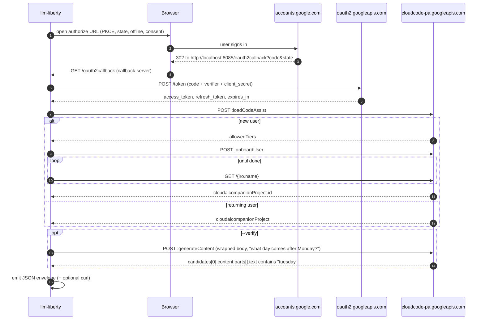

# Add Google Gemini provider

## Background

The official `@google/gemini-cli` authenticates users to a *private* Google API (`cloudcode-pa.googleapis.com/v1internal`) — not the public `generativelanguage.googleapis.com`. OAuth tokens issued under its `client_id` are scoped to that internal endpoint. Critically, every `generateContent` call also requires a `cloudaicompanionProject` id, which is itself discovered by calling `loadCodeAssist` after the OAuth exchange. So the login flow has three phases (OAuth → project discovery → optional generation smoke test) instead of the simpler two phases used by Anthropic / OpenAI Codex.

References:
- gemini-cli `oauth2.ts` (client_id, client_secret, scopes, redirect convention)
- gemini-cli `server.ts` (`CODE_ASSIST_ENDPOINT = https://cloudcode-pa.googleapis.com`, `v1internal`)
- sitegeist [`src/oauth/google-gemini-cli.ts`](../../badlogic/sitegeist/src/oauth/google-gemini-cli.ts) (browser-extension version of the same flow we're cloning the structure of)
- `[CLAUDE.md](CLAUDE.md)` client_id policy (base64-inline, single source of truth)

## Files

### New: [src/providers/google-gemini.ts](src/providers/google-gemini.ts)

`loginGoogleGemini({ verify, example, clipboard }: LoginOptions): Promise<void>`. Mirrors the structure of [src/providers/openai-codex.ts](src/providers/openai-codex.ts) and [src/providers/anthropic.ts](src/providers/anthropic.ts).

Constants (top of file):
- `CLIENT_ID` — hex-encoded in source; see `src/providers/google-gemini.ts`
- `CLIENT_SECRET` — hex-encoded in source; see `src/providers/google-gemini.ts`
- `AUTHORIZE_URL` = `https://accounts.google.com/o/oauth2/v2/auth`
- `TOKEN_URL` = `https://oauth2.googleapis.com/token`
- `CALLBACK_PORT` = `8085`, `CALLBACK_PATH` = `/oauth2callback`, `REDIRECT_URI` = `http://localhost:8085/oauth2callback`
- `SCOPES` = `cloud-platform userinfo.email userinfo.profile` (full URLs, space-joined)
- `API_BASE` = `https://cloudcode-pa.googleapis.com/v1internal`
- `VERIFY_MODEL` = `gemini-2.5-flash` (cheapest in the family — analogous to Haiku for Anthropic)
- `VERIFY_PROMPT` = `"answer in one word, what day comes after Monday?"`
- `OAUTH_HEADERS` = `{ "User-Agent": "google-api-nodejs-client/9.15.1", "X-Goog-Api-Client": "gl-node/22.17.0" }` (matches what sitegeist sends; the upstream API filters lightly on these)

Flow inside `loginGoogleGemini`:

1. `generatePkce()` (reuse [src/oauth/pkce.ts](src/oauth/pkce.ts)); random `state` from `randomBytes(32).toString("hex")`.
2. Build authorize URL with `response_type=code`, `client_id`, `redirect_uri`, `scope`, `state`, `code_challenge`, `code_challenge_method=S256`, `access_type=offline`, `prompt=consent` (the `offline` + `consent` pair is what guarantees a `refresh_token` on every login).
3. `waitForCallback({ port: 8085, path: "/oauth2callback" })` from [src/oauth/callback-server.ts](src/oauth/callback-server.ts) + `open(authUrl)` — same pattern as the existing two providers.
4. Validate returned `state` matches; pull `code`.
5. Exchange code: POST `TOKEN_URL` with `application/x-www-form-urlencoded` body `{client_id, client_secret, code, grant_type: "authorization_code", redirect_uri, code_verifier}`. Required response fields: `access_token`, `refresh_token`, `expires_in`. Throw `LibertyError` if any missing.
6. Call `discoverProject(accessToken)`:
   - POST `${API_BASE}:loadCodeAssist` with body `{ metadata: { ideType: "IDE_UNSPECIFIED", platform: "PLATFORM_UNSPECIFIED", pluginType: "GEMINI" } }`.
   - If `cloudaicompanionProject` is in the response, return it.
   - Otherwise it's a new user: pick `tierId` from `allowedTiers.find(t => t.isDefault)?.id ?? "free-tier"`, POST `${API_BASE}:onboardUser` with `{ tierId, metadata: {...same...} }`. Poll the returned LRO via GET `${API_BASE}/${lro.name}` every 5s until `done`. Extract `response.cloudaicompanionProject.id`.
   - This step runs *unconditionally* (not gated by `--no-verify`) — the project id is part of the credentials envelope and the user can't call the API without it.
7. Build the envelope (see below).
8. If `opts.verify`: pick `gemini-2.5-flash`, POST `${API_BASE}:generateContent` with body `{ model, project: <projectId>, request: { contents: [{ role: "user", parts: [{ text: VERIFY_PROMPT }] }] } }`, parse `response.candidates[0].content.parts[].text`, assert `/tuesday/i`. On success, spinner says `✓ Token verified (model: gemini-2.5-flash)`.
9. If `opts.example`: build curl example pointing at `:generateContent` with the wrapped body shape; pass to `emit()`.

Envelope shape:

```ts
{
  provider: "google-gemini",
  access_token,
  refresh_token,
  expires_at: Math.floor(Date.now() / 1000) + expires_in,
  auth: { in: "header", key: "Authorization", scheme: "Bearer" },
  authorize_url: AUTHORIZE_URL,
  token_url: TOKEN_URL,
  logout_url: null,
  headers: { ...OAUTH_HEADERS },
  body: { project: projectId },          // merge target — user adds `model` and `request`
  extra: {
    project_id: projectId,
    api_base: API_BASE,
    generate_content_url: `${API_BASE}:generateContent`,
    stream_generate_content_url: `${API_BASE}:streamGenerateContent?alt=sse`,
  },
}
```

The user's actual request body becomes `{ ...creds.body, model: "gemini-2.5-flash", request: { contents: [...] } }` — slightly different "shape" than other providers (Gemini wraps the real request inside a `request:` key), so the docs explicitly call this out.

### Edit: [src/cli.ts](src/cli.ts)

Wire the new provider into `dispatch()` and the unknown-provider error message:

```37:58:src/cli.ts
async function dispatch(provider: string, flags: LoginFlags): Promise<void> {
  switch (provider) {
    case "anthropic":
      await loginAnthropic({ /* … */ });
      return;
    case "openai-codex":
      await loginOpenAICodex({ /* … */ });
      return;
    default:
      throw new LibertyError(
        `Unknown provider: ${provider}. Supported providers: anthropic, openai-codex.`,
      );
  }
}
```

Add `case "google-gemini"` calling `loginGoogleGemini(...)`, update the unknown-provider list to include `google-gemini`, add the import.

### New: [docs/google-gemini.md](docs/google-gemini.md)

Mirrors the structure of [docs/anthropic.md](docs/anthropic.md) and [docs/openai-codex.md](docs/openai-codex.md). Sections: header + `npx` invocation, "Example output" (envelope + curl), "Flags" (verify/example/clipboard), "Calling the API with the resulting token" (explains the wrapped body: `{model, project, request:{contents:[…]}}` and the `cloudcode-pa` vs `generativelanguage` distinction so users don't try the wrong endpoint), "Operational notes" (port 8085 must be free; refresh token semantics; what subscription tiers are eligible — free + AI Pro). Mention up front that `loadCodeAssist` runs even with `--no-verify` because the project id is part of the credential.

### Edit: [docs/index.md](docs/index.md)

Add a bullet `- [**google-gemini.md**](google-gemini.md) — login google-gemini: Google Gemini / gemini-cli.` directly under the openai-codex one.

### Edit: [README.md](README.md)

Add `- **Google Gemini** (gemini-cli / Code Assist) — see [docs/google-gemini.md](docs/google-gemini.md)` under "Supported providers"; remove "Google Gemini" from the parenthetical "_(More coming — Google Gemini, GitHub Copilot.)_" line.

### New: `.changeset/<auto>-google-gemini-provider.md`

Minor bump per [docs/development.md](docs/development.md) workflow:

```md
---
"llm-liberty": minor
---

Add `login google-gemini` provider — runs the gemini-cli OAuth flow, discovers the user's Code Assist project, and emits the standard JSON envelope plus a working curl for `cloudcode-pa.googleapis.com/v1internal:generateContent`.
```

## Flow diagram



## Validation

1. `pnpm typecheck && pnpm lint` clean.
2. Manual smoke: `pnpm cli login google-gemini` against a real Google account → JSON envelope + curl printed; copy-paste curl works.
3. `pnpm cli login google-gemini --no-verify` skips only the `:generateContent` call (project discovery still runs).
4. `pnpm cli login google-gemini --no-example --no-clipboard` produces parseable JSON on stdout, nothing else.

## Out of scope

- No refresh-token automation (matches existing providers — refresh is documented for users to perform themselves).
- No support for `streamGenerateContent` in the curl example beyond a comment in the docs (the envelope's `extra.stream_generate_content_url` is enough for users who want it).
- No `google-vertex` / `google-antigravity` providers — separate flows, separate PRs.